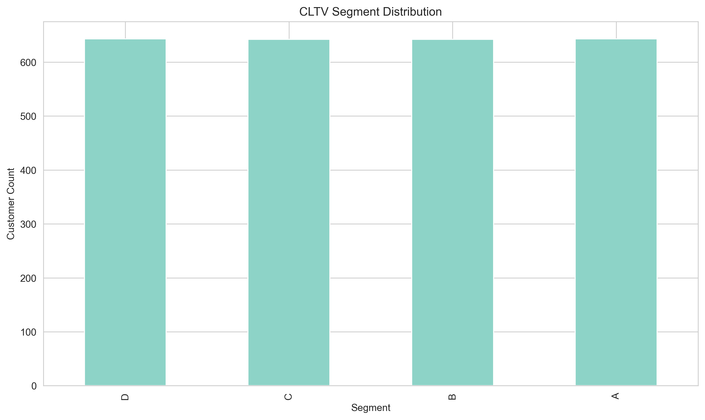
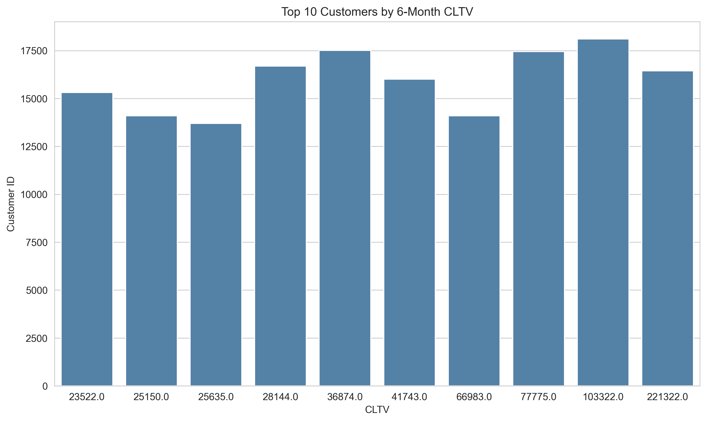

# Customer Lifetime Value Prediction

## Project Overview

This project is a Data Analyst portfolio case study built in Python and developed in PyCharm. It predicts Customer Lifetime Value (CLTV) for UK customers using probabilistic customer analytics models and translates the results into practical business insights.

The analysis focuses on estimating future customer value from historical transaction behavior, comparing multiple prediction horizons, segmenting customers by value, and supporting marketing and retention decision-making.

## Executive Summary

This project applies BG-NBD and Gamma-Gamma models to estimate customer-level CLTV from the Online Retail II dataset for the 2010-2011 period. The workflow cleans transactional data, isolates UK customers, removes cancellations and incomplete customer records, and generates model-based CLTV estimates for different business horizons.

Key portfolio KPIs:
- Customers (UK): `2,570`
- Avg 6M CLTV: `1,676.99`
- Top 10 Avg CLTV: `65,047.02`
- Highest 6M CLTV Segment Share: `25.02%`
- 1M vs 12M CLTV Growth Indicator: `+982.95%`

## Business Problem

A UK-based retail business wants to improve sales and marketing planning by identifying which customers are expected to generate the most future value.

This project addresses that need by:
- Predicting 6-month CLTV for existing customers
- Comparing 1-month and 12-month CLTV estimates
- Segmenting customers based on 6-month CLTV
- Generating business-oriented recommendations for customer targeting and retention

## Dataset

- **Dataset:** Online Retail II
- **Period used:** 2010-2011 transaction data
- **Customer scope:** UK customers only
- **Repository note:** Raw data is **not included** in this repository
- **Expected location:** `data/raw/`

The project uses transactional retail data containing invoices, purchase dates, product information, quantities, prices, customer IDs, and country fields.

Data preparation includes:
- Removing missing customer IDs
- Removing cancelled invoices
- Filtering to UK customers only
- Keeping positive quantity and price records
- Creating `TotalPrice` as `Quantity × Price`

## Project Structure

```text
customer-lifetime-value-prediction/
├── data/
│   ├── raw/
│   └── processed/
│       ├── cltv_6m.csv
│       ├── cltv_1m_vs_12m.csv
│       └── cltv_segment_summary.csv
├── notebooks/
│   └── cltv_prediction.ipynb
├── images/
│   ├── cltv_segment_distribution.png
│   ├── top10_cltv_6m.png
│   └── cltv_1m_vs_12m.png
├── src/
│   ├── data_prep.py
│   ├── cltv_builder.py
│   └── segmentation.py
├── README.md
├── requirements.txt
├── .gitignore
└── .gitattributes
```

## Methodology

The project follows a structured analytics workflow designed to move from raw transaction data to decision-ready customer value outputs.

1. **Data cleaning**  
   The raw retail dataset is loaded and reviewed for missing values, transaction validity, and customer coverage.

2. **Cancelled invoice removal**  
   Cancelled invoices are removed to prevent negative or reversed transactions from distorting customer purchase behavior.

3. **UK customer filtering**  
   The analysis is limited to UK customers to ensure consistency in customer behavior and business interpretation.

4. **TotalPrice calculation**  
   A transaction-level revenue field is created using quantity and unit price.

5. **CLTV modeling table creation**  
   Customer-level features are built for modeling, including recency, frequency, monetary value, and observation time.

6. **Short-term and long-term comparison**  
   CLTV is estimated across different horizons, including 1-month, 6-month, and 12-month periods, to compare short-term and long-term value expectations.

7. **Segmentation**  
   Customers are grouped into CLTV-based segments to support prioritization, campaign design, and retention strategy.

## Modeling Approach

### BG-NBD Model

The BG-NBD (Beta-Geometric / Negative Binomial Distribution) model estimates the expected number of future purchases for each customer based on historical purchase frequency and recency. It is well suited for non-contractual settings where customer churn is not directly observed.

In this project, BG-NBD is used to answer a core business question: **how often is each customer expected to purchase again?**

### Gamma-Gamma Model

The Gamma-Gamma model estimates expected average monetary value per transaction for customers with repeat purchase behavior. It complements BG-NBD by modeling spend rather than purchase timing.

In this project, Gamma-Gamma is used to estimate: **how much profit or value is each customer expected to generate per purchase?**

### Combined CLTV Estimation

These two models are combined to calculate CLTV:

- BG-NBD estimates expected future purchase count
- Gamma-Gamma estimates expected average profit per transaction
- Together, they produce a forward-looking CLTV estimate across different time horizons

This creates a more robust customer valuation framework than relying only on historical revenue totals.

## Key Insights

- High-value customers are typically concentrated in a relatively small portion of the customer base.
- Short-term and long-term CLTV rankings may differ, meaning customers who look valuable in the near term may not always be the strongest long-term targets.
- CLTV-based segmentation supports action planning by turning model outputs into usable business groups for retention, upsell, and loyalty strategies.

## Visualizations

### CLTV Segment Distribution


### Top 10 Customers by 6-Month CLTV


### 1-Month vs 12-Month CLTV Comparison


## Outputs

The project generates business-ready output files under `data/processed/`:

- **`cltv_6m.csv`**  
  Customer-level 6-month CLTV predictions used for ranking and prioritization.

- **`cltv_1m_vs_12m.csv`**  
  Comparative CLTV output for short-term and long-term value analysis.

- **`cltv_segment_summary.csv`**  
  Segment-level summary table showing the distribution and profile of customers across CLTV groups.

## How to Run

1. Clone the repository.
2. Install dependencies:

```bash
pip install -r requirements.txt
```

3. Place the raw dataset under:

```text
data/raw/
```

4. Open and run:

```text
notebooks/cltv_prediction.ipynb
```

Important note:
- The raw dataset is **not included** in this repository.
- The project expects the Online Retail II Excel file to be available locally under `data/raw/`.

## Future Improvements

- Add automated validation checks for data quality and model inputs
- Extend the analysis to non-UK customers for market comparison
- Compare model-based CLTV with simpler heuristic baselines
- Add dashboard-style reporting for segment monitoring
- Introduce campaign simulation scenarios based on customer segments
- Package the workflow into reusable scripts for faster production-style execution
